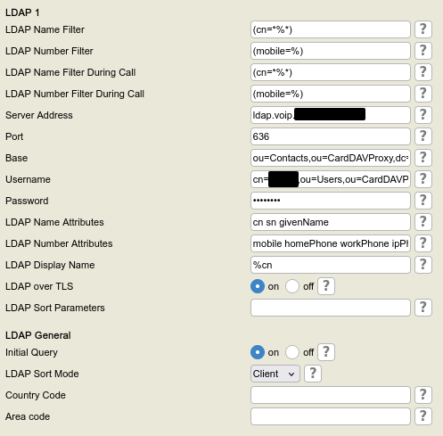
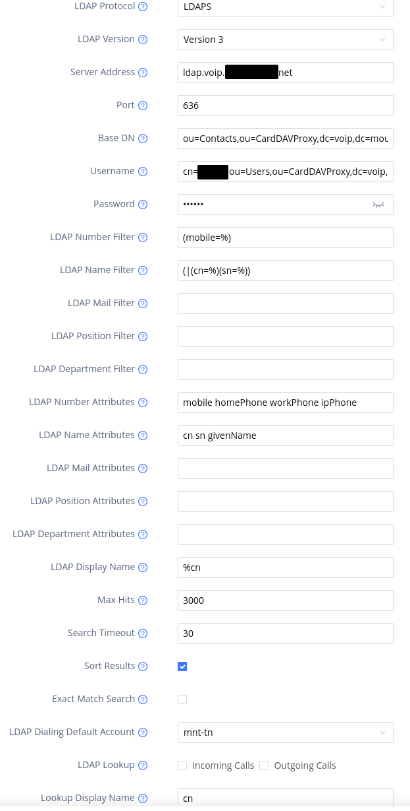

# Tested Devices

## Snom D785

LDAP settings are configured via the web interface under **Setup → Advanced → LDAP 1**.

## Grandstream WP826

LDAP settings are configured via the web interface under **Application → LDAP**.

